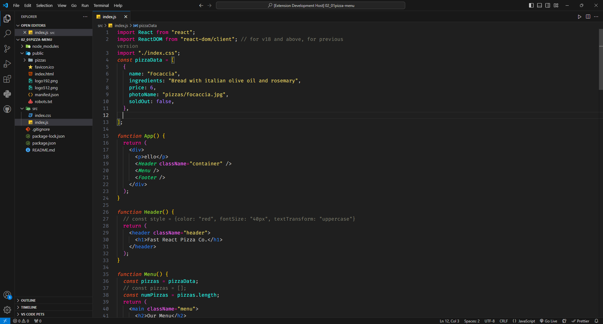

# Celestial Monokai Dark theme

This theme is designed keeping in mind that there are lots of
people who want to maintain their aesthetic from vscode modern dark theme but they dont like the color pallete for text and code. This theme changes that issue and provide you with a beautiful color pallete that goes well with the vs code dark theme. The challenges that I faced during the same are resolved in this theme such as bright token color of functions and strings etc for better coding experience etc.

It took me around 11 month to analyse all these issues and finally publish this theme.


# Celestiial Monokai Dark


### Features

+ Best in recoding videos
+ Highlights your active tab
+ Each language token is customized

Some font settings that I use:

```json
    "editor.fontFamily": "Fira Code",
    "editor.fontSize": 18,
    "terminal.integrated.fontSize": 18,
    "window.zoomLevel": 1,
    "editor.wordWrap": "on",
```
# My Name is `Atulit Gupta` and I am a Web Developer and Python programmer.